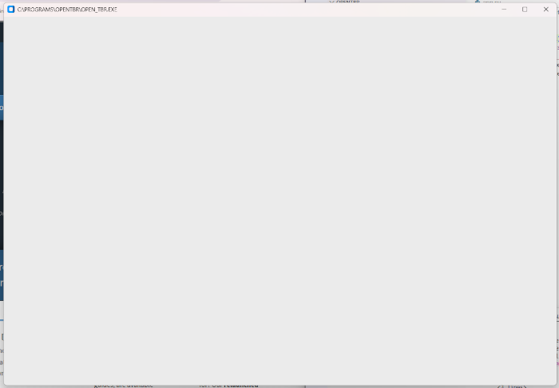

One of the things I've noticed that a lot of the, at least seemingly, successful people in the Cybersecurity/Programming/Development space do is they create useful apps and programs. Some use Python, some use JavaScript, and others use TypeScript. I had taken a class on Python in 2019 or 2020 and so I have the basics, but it's been a while since I've actually made anything in Python. So, I decided to create something useful - even if only I find it useful. And that is how the project for OpenTBR was created.

## What is OpenTBR? 
OpenTBR is a TBR tracker. What is a TBR? It is the list of books one wishes to eventually get around to reading - a "to be read" list/shelf/pile. So what will OpenTBR do? Well, it will allow you to add books to your TBR database, edit or delete those books, and view your TBR list. At least to start. Right now, I'm working on something simple - creating a window for the program to run in.

## Getting Started on OpenTBR
### Creating a Folder and Initializing Git
My first task was to open up VS Codium and create my project folder, which ended up being titled OpenTBR. Easy, peasy. Most of us probably already know how to create a new folder. I opened the terminal in VS Codium and initialized the Git repo with 
<pre><code>
git init
</code></pre>

Note: If you don't have Git installed on your system, you will need to do so. You can go to <a href="https://git-scm.com" target="_blank">Git SCM</a> to learn how to install Git on your own system.

### Installing customtkinter
After that, I installed customtkinter onto my system, since I already had Python installed. I went to the search bar on my Task Bar and searched CMD to bring up a command prompt, then typed the following into the system. If you don't have Python installed already, you'll need to install it first or this isn't going to work. Go to <a href="https://python.org" target="_blank">Welcome to Python.org</a> for more information on how to install Python.

<pre><code>
pip install customtkinter
</code></pre>

### Creating the App File
Back in VS Codium, I created a new file in my OpenTBR folder and named it app.py. This app.py file is going to house my Python code. 

### Creating a Window
I don't want this program to run completely in the terminal - I want it to have a GUI. To have a GUI, I need a window. This is, in part, where customtkinter comes in. There are two ways to get a window using customtkinter. They both start the same way:
<pre><code>
import customtkinter as ctk
</code></pre>

#### Method 1 > Function
Now that we've imported customtkinter and told Python to accept just all-lowercase ctk in lieu of typing out the full name of the library, we create our window. The first way is to use the following:
<pre><code>
import customtkinter as ctk

app = ctk.CTk()
app.geometry("1200x800")
app.title("C:\\PROGRAMS\\OPENTBR\\OPEN_TBR.EXE")

app.mainloop()
</code></pre>

So for this code block, we have imported customtkinter as ctk and we defined a variable named app as being equal to ctk.CTk(). 

Now, we assign some properties to the app variable such as geometry. Geometry tells Python how big to make the window. In my case, I chose to make the window 1200 pixels wide and 800 pixels tall. This fits nicely on the screen of my Dell Inspiron 15 laptop and will likely fit well on laptop screens, including 13" models as there is a nice amount of space around the window left over. 

The property for title gives the window a title - in this case, I chose to give it a fun title of C:\PROGRAMS\OPENTBR\OPEN_TBR.EXE <<< this will show in the title bar of the window.

The last piece is app.mainloop() - which is what calls the window into being when app.py is run. This part appears in both versions.

#### Method 2 > Class

Our app.py still starts with importing customtkinter, but from there on, we'll be using a different method - class - to handle creating the window.

<pre><code>
import customtkinter as ctk

class App(ctk.CTk):
    def __init__(self):
        super().__init__()
        self.geometry("1200x800")
        self.title("C:\\PROGRAMS\\OPENTBR\\OPEN_TBR.EXE")

app = App()
app.mainloop()
</code></pre>

So in this version, instead of using a function, we've used a class and added definitions to create the window. The class method is considered the "best practice" method, at least according to the video I watched by <a href="https://www.youtube.com/watch?v=Yp8tmXt76wk" target="_blank">Pybeginners on Youtube</a> about doing this. But it still needs the app.mainloop() to call the window into existence when the code is run.

In the terminal, I put py app.py to run the program and call up the window. Regardless of which method you use to call it up, it looks like this:

So that's part one of creating the OpenTBR app using Python and customtkinter. The next step will be to add a list of entries into the window. 

